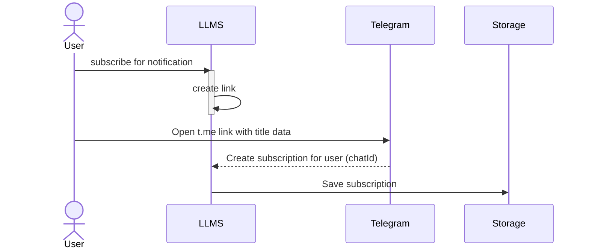
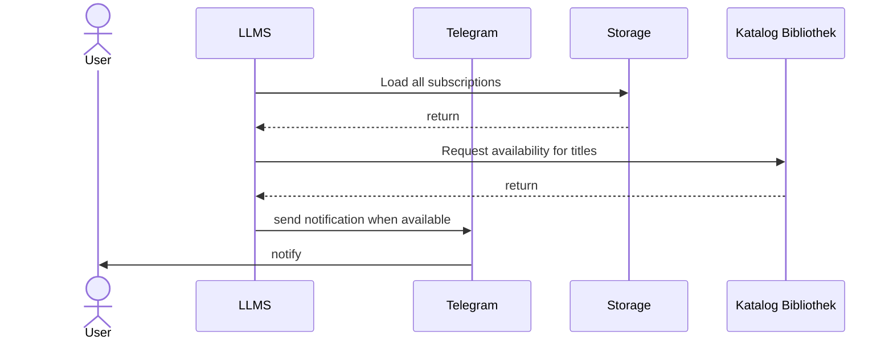

# User Story
As a User i want to be able to subscribe for a notification for a currently not available title on my watchlist.

# Decisions

## Telegram as notification channel
- easy to implement with a simple bot
- no further accounts needed 
- technical less complicated than sending an email

## Notifier as a separate executable
??

# Use Cases

## Subscribe for notification 

## Scheduled check subscriptions 

